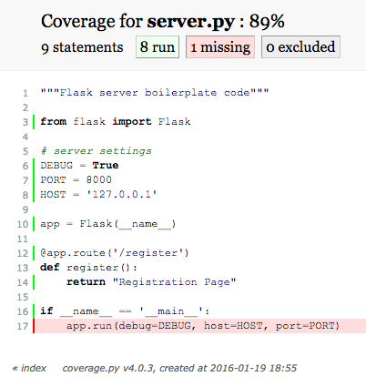

## Step 5 - Writing Simple Boilerplate For Simple Tests

(1/19/16) So, if you're a treehouse student who finished the "Build
A Social Network With Flask" course, like I am, you most
likely forgot the "Flask Basics" course altogether, and
are ready to make this project really freaking complex. I
felt the same way, and was importing all kinds of 
LoginManagers, making before and after request methods,
and generally ignoring the test I spent all that time writing.

So...what am I testing for?

### 1. Getting a 200 status code from a server

Oh, that's right. Well, how do you do that? Basically
you receive a request at a url, and then send anything at 
all back. This ain't rocket science. This is about as 
simple as it gets. I'm going to 

- Import the Flask class from the flask module, 

- store our server settings in global variables for convenence,

- and create a flask object named app from the flask class.

- I use that object to attach a route for our register page

- that returns some kind of text, any kind of text

- then run the flask instance.

This is about as simple as a server gets, and I want
to bring it down to this level before we build it up, 
so I understand EVERYTHING, and test EVERYTHING. So
all this looks like...

```python

"""Flask server boilerplate code"""

# Import the Flask class from the flask module
from flask import Flask

# store our server settings in global variables for convenence
DEBUG = True
PORT = 8000
HOST = '127.0.0.1'

# create a flask object named app from the flask class
app = Flask(__name__)

# use that object to attach a route for our register page    
@app.route('/register')
def register():
    # return some kind of text, any kind of text
    return "Registration Page"

# run the flask instance
if __name__ == '__main__':
    app.run(debug=DEBUG, host=HOST, port=PORT)
    
```

...and I actually managed to avoid giving away any
direct code challenge answers, though if you haven't finished
the code challenges that go with this, but you followed 
me all the way here, you're doing something wrong, go back and
take ["Flask Basics"](https://teamtreehouse.com/library/flask-basics/welcome-to-flask/first-steps). Most of what I'm doing here
I learned from there.

And that is all it takes to get a 200 status code. We're
not connected to a database or making posts or checking for
template phrasing or any of that. All we wrote was a status 
test in [_server_tests.py](https://github.com/nicolasjhampton/python_tutorial_game_project/blob/9c2442b7320c169dfd00ace697aea3595b56d29c/_server_tests.py), so we made a server that could 
return a couple words and a 200 status code. Let's take a look 
at our test coverage using ```coverage run _server_tests.py``` 
and ```coverage report```

```

(vpython)Nicolass-MacBook-Pro:GameProject nicolasjhampton$ coverage run _server_tests.py
.
----------------------------------------------------------------------
Ran 1 test in 0.094s

OK
(vpython)Nicolass-MacBook-Pro:GameProject nicolasjhampton$ coverage report
Name                                                                                           Stmts   Miss  Cover
------------------------------------------------------------------------------------------------------------------
_server_tests.py                                                                                  19      0   100%
models.py                                                                                         41     22    46%
server.py                                                                                          9      1    89%
(... packages omitted for clarity ...)
------------------------------------------------------------------------------------------------------------------
TOTAL                                                                                          16938  10881    36%

```

See that [server.py](https://github.com/nicolasjhampton/python_tutorial_game_project/blob/9c2442b7320c169dfd00ace697aea3595b56d29c/server.py) value of 89%? That's the only one I care
about. I'm not testing the tests, and I'm not running tests
for the models here, so of course coverage on models.py is 
going to be low. There's like 50 packages listed after server
that I omitted that are things we imported that are already
tested by other people, and those packages we don't have to 
test are throwing off our total at the bottom. Still, we
only reached 89%. Somehow we missed 1 line out of ten. If
we run ```coverage html```, we'll get an entire website report
created, and we can see exactly which line I missed...



Oh, it's just the run line? Well, I think I can skip the run
line. So, for all intensive purposes, we're starting with 
a completely tested file. THAT'S why we're starting simple.

### 2. I think I saved a registration test for later, right?

Yea, I think I did. While looking at Kenneth's tests for the
tacocat project, this one test seemed like it bridged a lot
of upcoming things together for me, so I copied it and saved 
it for later. Now, looking back on it, I think I'll uncomment 
it and add some quick notes...

```python

    # Saving this for later...
    # We'll need 
    # 1. a form file and 
    # 2. a post node on our view function (this may need another status test) and
    # 3. before and after request methods to connect and close the database 
    def test_registration(self):
        data = {
            'username': 'testUsername',
            'email': 'test@example.com',
            'password': 'password',
            'password2': 'password'
        }
        with test_database(self.TEST_DB, (User,)): # I added the self reference to the TEST_DB
            rv = self.app.post(
                '/register',
                data=data)
            self.assertEqual(rv.status_code, 302)
            self.assertEqual(rv.location, 'http://localhost/')
            
```
 
So, a couple things have to happen for us to pass this test, 
but before we get into that, let's take another look at our 
plan so far...


### 3. The plan so far...
 
 
- I'll design the database table that stores the user data (done)

    * Winged it mostly (done)

- Then I can add login,logout, and password hash information to that database (mostly done)

    1. Use B-crypt to hash the password stored in our User model (done)
        * I'll start this by writing 2 tests (done)
            - one to check the password is hashed (done)
            - another to check we can check a hashed password entry against it (done)
            
    2. Use flask-login User mixin to check login id and status (kinda done)
        *  I'll write a few tests (not sure how many, at least 2) (done)
            - one to check a user id is present after user creation (done)
            - another to check a login status (in or out) is present (pushing this to later)

- By then, I can build the flask server that will serve our first route... (Uh, yeah, sure, let's do this)

    1. There will be a url to get to a register page (url done, I think)
        * We can test for basic connectivity (Done, I think)
            - We need a 200 response from our /register route (Done)
        * We need a register prompt (Why don't I seem ready for this?)
            - We can test for the presence of username, email, and password fields (Presence where?!)
        * We can test... (Blah blah blah)

- The HTML register user screen that creates new users.


I'm a little lost here for two reasons. One is that I have 
some tasks in the wrong place. Let's fix that first...

- By then, I can build the flask server that will serve our first route... (Uh, yeah, sure, let's do this)

    1. There will be a url to get to a register page (url done, I think)
        * We can test for basic connectivity (Done, I think)
            - We need a 200 response from our /register route (Done)
        

- The HTML register user screen that creates new users.

    1. We need a register prompt (oh, this makes sense)
        * We can test for the presence of username, email, and password fields
        * We can test... (Blah blah blah)
        

The other reason is that we missed a level of abstraction. 
This register route has to have a POST method, and that 
POST method not only gives a status code of its own but 
can take data and create database entries on its own, without
any visual field. Let's try that one more time...


- By then, I can build the flask server that will serve our first route... (Uh, yeah, sure, let's do this)

    1. There will be a url to get to a register page 
        * We can test for basic connectivity (half done)
            - We need a 200 response from our /register GET route (Done)
            - We need a status code response from our /register POST route (Where we are now)
        
- The HTML register user screen that creates new users.

    1. We need a register prompt (oh, this makes sense)
        * We can test for the presence of username, email, and password fields
        * We can test... (Blah blah blah)
        
        
Also, we forgot about forms...


- By then, I can build the flask server that will serve our first route... (Uh, yeah, sure, let's do this)

    1. There will be a url to get to a register page 
        * We can test for basic connectivity (half done)
            - We need a 200 response from our /register GET route (Done)
            - We need a status code response from our /register POST route (Where we are now)
            
- Forms
        
- The HTML register user screen that creates new users.

    1. We need a register prompt (oh, this makes sense)
        * We can test for the presence of username, email, and password fields
        * We can test... (Blah blah blah)


There, we added forms to our plan. Don't ask me how we're going to 
test them independently and for what yet, because I don't really
know yet. But we're going to write tests for them, then we're going
to navigate safely through the asteroid field, just don't tell
me the odds and shut that droid up.


### Episode 4 - A New Route...

So, first attempt looks like this...

```python

@app.route('/register', methods=['GET'])
def register():
    return "Registration Page"
    
@app.route('/register', methods=['POST'])
def register():
    return "Registered!"
    
```

and I received this error...

```

(vpython)Nicolass-MacBook-Pro:GameProject nicolasjhampton$ coverage run _server_tests.py
Traceback (most recent call last):
  File "_server_tests.py", line 11, in <module>
    import server
  File "/Users/nicolasjhampton/GitHub/GameProject/server.py", line 16, in <module>
    @app.route('/register', methods=['POST'])
  File "/Users/nicolasjhampton/GitHub/vpython/lib/python3.5/site-packages/flask/app.py", line 1013, in decorator
    self.add_url_rule(rule, endpoint, f, **options)
  File "/Users/nicolasjhampton/GitHub/vpython/lib/python3.5/site-packages/flask/app.py", line 62, in wrapper_func
    return f(self, *args, **kwargs)
  File "/Users/nicolasjhampton/GitHub/vpython/lib/python3.5/site-packages/flask/app.py", line 984, in add_url_rule
    'existing endpoint function: %s' % endpoint)
AssertionError: View function mapping is overwriting an existing endpoint function: register

```

I would resist being afraid when yo receive an error. Just be
glad you received an error at all. It's when you don't, but
something is clearly not working, that good days become bad 
days. In this case, this was a 3 second fix: I named 2 route
functions with the same name. So when I ran tests on the quick 
change...

```python

@app.route('/register', methods=['GET'])
def register():
    return "Registration Page"
    
@app.route('/register', methods=['POST'])
def post_registration():
    return "Registered!"
    
```

I received this failure instead...

```
(vpython)Nicolass-MacBook-Pro:GameProject nicolasjhampton$ coverage run _server_tests.py
.F
======================================================================
FAIL: test_registration (__main__.AppTestCase)
----------------------------------------------------------------------
Traceback (most recent call last):
  File "_server_tests.py", line 64, in test_registration
    self.assertEqual(rv.status_code, 302)
AssertionError: 200 != 302

----------------------------------------------------------------------
Ran 2 tests in 0.747s

FAILED (failures=1)
```

OUTSTANDING! Not only are we back to failing tests, but we 
know exactly where to look for our failure: An incorrect 
status code response! The test got a 200 response instead of
a 302. Great, we can fix that!


### 5. Wait, what the heck do those numbers mean?

...and why was Kenneth testing for a 302 instead of a good ol'
200 OK? ([A list of status codes](https://en.wikipedia.org/wiki/List_of_HTTP_status_codes), you're welcome)

Well, the original test was for a 302 FOUND redirection status
code, which indicates that after the request, the response was
successfully redirected to another URL. That's because the site
we pulled this from was redirecting a /register post to a /login
get route. I'll do the same thing later, but for right now, I just
want to make sure I can post successfully, without a redirect, so
I'm going to change the test to check for a 200 status code for
now, run it again, and...

```
(vpython)Nicolass-MacBook-Pro:GameProject nicolasjhampton$ coverage run _server_tests.py
.F
======================================================================
FAIL: test_registration (__main__.AppTestCase)
----------------------------------------------------------------------
Traceback (most recent call last):
  File "_server_tests.py", line 65, in test_registration
    self.assertEqual(rv.location, 'http://localhost/')
AssertionError: None != 'http://localhost/'

----------------------------------------------------------------------
Ran 2 tests in 0.240s

FAILED (failures=1)
```

Oh yeah, for the time being, let's forget about the location check 
too...

```
(vpython)Nicolass-MacBook-Pro:GameProject nicolasjhampton$ coverage run _server_tests.py
..
----------------------------------------------------------------------
Ran 2 tests in 0.153s

OK
```

Looks great! And coverage report says the [server.py]() file is at 91%
coverage with the new [_server_test.py](). Great! That is, if we're 
ok with our data going no where and doing nothing. Look like we're 
ready to hook that database to our POST route in [step 6](https://github.com/nicolasjhampton/python_tutorial_game_project/blob/master/blog/step5.md)... 


